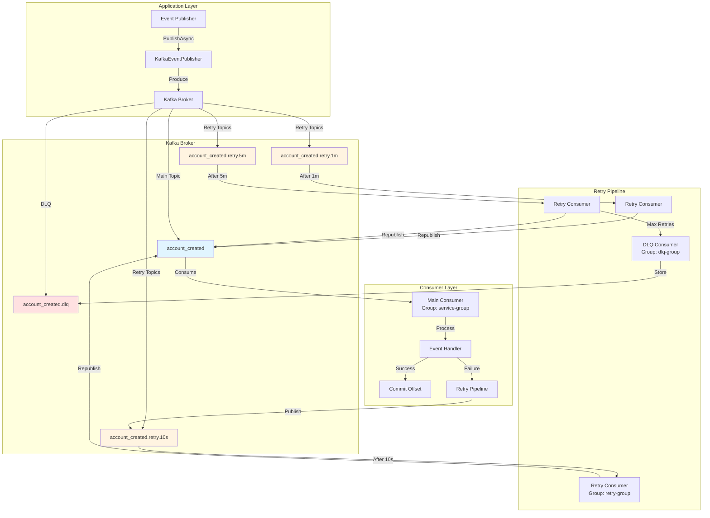
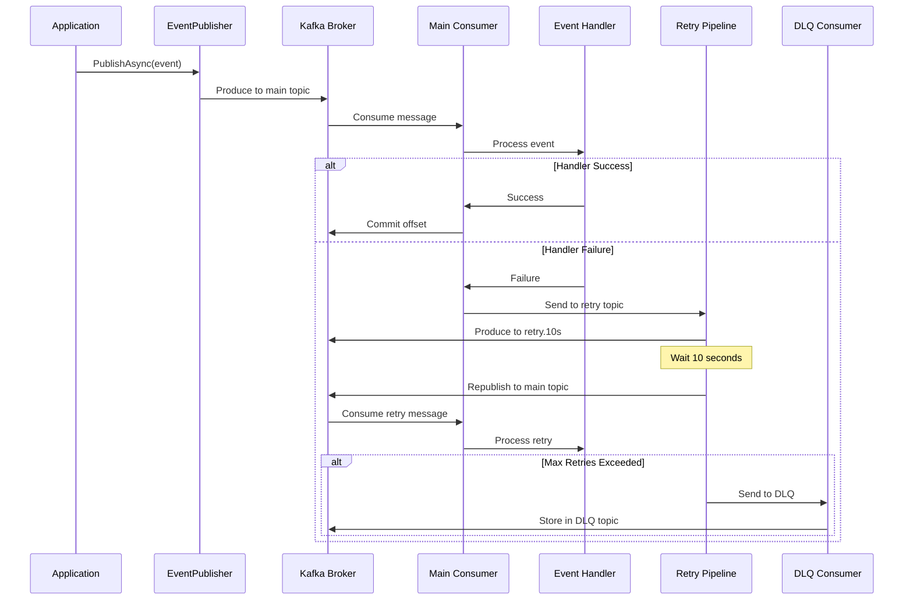

# Kafka EventBus Architecture & Implementation Guide

## 📋 Table of Contents

1. [Overview](#overview)
2. [Architecture](#architecture)
3. [Retry Pipeline](#retry-pipeline)
4. [Components](#components)
5. [Configuration](#configuration)
6. [Known Issues & TODOs](#known-issues--todos)
7. [Best Practices](#best-practices)

---

## Overview

This document describes the Kafka-based EventBus implementation for the ASP.NET Web API template. The EventBus provides:

- **Asynchronous event publishing** using Kafka topics
- **Automatic retry mechanism** with exponential backoff
- **Dead Letter Queue (DLQ)** for failed messages
- **Consumer group coordination** for offset management
- **Header propagation** through retry pipeline

### Key Features

- ✅ Topic-based event routing
- ✅ Automatic retry with configurable delays (10s, 1m, 5m)
- ✅ Dead Letter Queue for messages exceeding max retries
- ✅ Consumer group support for horizontal scaling
- ✅ Offset management and commit coordination
- ✅ Header preservation through retry pipeline

---

## Architecture

### High-Level Architecture Diagram



### Component Interaction Flow



---

## Retry Pipeline

### Retry Flow

The retry pipeline implements a **3-level exponential backoff** strategy:

1. **Level 1 (10 seconds)**: First retry after 10 seconds
2. **Level 2 (1 minute)**: Second retry after 1 minute
3. **Level 3 (5 minutes)**: Third retry after 5 minutes
4. **DLQ**: After 3 failed retries, message goes to Dead Letter Queue

### Retry Topic Structure

```
Main Topic:        account_created
Retry Topics:      account_created.retry.10s
                   account_created.retry.1m
                   account_created.retry.5m
DLQ Topic:         account_created.dlq
```

### Retry Message Flow

```mermaid
graph LR
    A[Main Topic] -->|Handler Fails| B[Retry Topic 10s]
    B -->|Wait 10s| C[Republish to Main]
    C -->|Handler Fails| D[Retry Topic 1m]
    D -->|Wait 1m| E[Republish to Main]
    E -->|Handler Fails| F[Retry Topic 5m]
    F -->|Wait 5m| G[Republish to Main]
    G -->|Handler Fails| H[DLQ Topic]
    
    style A fill:#e1f5ff
    style B fill:#fff4e1
    style D fill:#fff4e1
    style F fill:#fff4e1
    style H fill:#ffe1e1
```



### Retry Message Envelope

Messages in retry topics are wrapped in a `RetryMessageEnvelope`:

```json
{
  "originalTopic": "account_created",
  "originalKey": "event-id-123",
  "originalPayload": "{ ... event data ... }",
  "retryCount": 1,
  "retryDelay": "00:00:10",
  "errorReason": "Database connection timeout",
  "originalEventId": "guid-here"
}
```

### Headers

Republished messages include headers:
- `X-Retry-Count`: Number of retry attempts (1, 2, 3)
- `X-Is-Retry`: "true" for retry messages
- `X-Retry-From`: Original topic name
- `retry-count`: Retry count in message headers

---

## Components

### Core Components

#### 1. **KafkaClient** (`KafkaClient.cs`)
- Main EventBus implementation
- Manages consumer lifecycle
- Handles subscription management
- Coordinates with retry pipeline

#### 2. **KafkaEventPublisher** (`KafkaEventPublisher.cs`)
- Publishes events to Kafka topics
- Uses `IProducer<string, string>`
- Handles serialization

#### 3. **SubscriptionsProcessor** (`SubscriptionsProcessor.cs`)
- Processes consumed messages
- Dispatches to event handlers
- Handles failures and triggers retry pipeline
- Commits offsets after successful processing

#### 4. **RetryPipelineService** (`RetryPipelineService.cs`)
- Manages retry consumers for each retry level
- Manages DLQ consumer
- Starts/stops retry consumers dynamically

#### 5. **RetryConsumer** (`RetryConsumer.cs`)
- Consumes messages from retry topics
- Waits for configured delay
- Republishes to main topic with headers
- Handles retry orchestration

#### 6. **RetryProducer** (`RetryProducer.cs`)
- Publishes messages to retry topics
- Publishes messages to DLQ
- Manages retry message envelope creation

#### 7. **DlqConsumer** (`DlqConsumer.cs`)
- Consumes messages from DLQ topics
- Logs failed messages for manual inspection
- Can be extended for alerting/monitoring

### Component Dependencies

```
KafkaClient
├── IEventPublisher (KafkaEventPublisher)
├── ISubscriptionsProcessor
│   ├── IEventDispatcher
│   ├── IRetryProducer
│   └── RetryConfiguration
└── IConsumerFactory

RetryPipelineService
├── IRetryConsumerFactory
│   └── RetryConfiguration
├── IDlqConsumer
└── RetryConfiguration
```

---

## Configuration

### Kafka Configuration

```json
{
  "Kafka": {
    "BootstrapServers": "localhost:9092",
    "GroupId": "my-microservice-group",
    "AutoOffsetReset": "Earliest",
    "IsConsumptionEnabled": true,
    "Retry": {
      "IsRetryEnabled": true,
      "MaxRetryAttempts": 3,
      "RetryDelay10Seconds": "00:00:10",
      "RetryDelay1Minute": "00:01:00",
      "RetryDelay5Minutes": "00:05:00",
      "RetryConsumerGroupId": "my-microservice-retry",
      "DlqConsumerGroupId": "my-microservice-dlq"
    }
  }
}
```

### Configuration Properties

| Property | Description | Default |
|----------|-------------|---------|
| `BootstrapServers` | Kafka broker addresses | Required |
| `GroupId` | Consumer group ID | Required |
| `AutoOffsetReset` | Offset reset policy (`Earliest`, `Latest`, `Error`) | `Earliest` |
| `IsConsumptionEnabled` | Enable/disable message consumption | `true` |
| `Retry:IsRetryEnabled` | Enable/disable retry pipeline | `true` |
| `Retry:MaxRetryAttempts` | Maximum retry attempts before DLQ | `3` |
| `Retry:RetryDelay10Seconds` | Delay for first retry | `00:00:10` |
| `Retry:RetryDelay1Minute` | Delay for second retry | `00:01:00` |
| `Retry:RetryDelay5Minutes` | Delay for third retry | `00:05:00` |

### Consumer Groups

- **Main Consumer Group**: Processes messages from main topics
- **Retry Consumer Group**: Processes messages from retry topics (one per retry level)
- **DLQ Consumer Group**: Processes messages from DLQ topics

Each consumer group maintains its own offset, allowing independent scaling and processing.

---

## Known Issues & TODOs

### 🚨 Critical Issues

#### 1. **Multi-Service Retry Duplication**

**Problem**: When multiple microservices (different consumer groups) subscribe to the same topic, and one service's handler fails, the retry pipeline republishes the message back to the main topic. This causes **ALL consumer groups** to receive the republished message, not just the failing service.

**Impact**:
- Services that successfully processed the original message will process it again
- Requires all handlers to be idempotent
- Unnecessary load on all services

**Current Workaround**:
- Handlers must be idempotent
- Retry headers (`X-Retry-Count`, `X-Is-Retry`) are available for detection
- Event IDs should be used for idempotency checks

**Proposed Solutions**:
1. **Consumer-Group-Specific Retry Topics** (Recommended)
   - Create retry topics per consumer group: `account_created.retry.10s.service-1-group`
   - Each service retries independently
   - No duplicate processing across services

2. **Handler-Level Retry Detection**
   - Enhance handlers to detect and skip retries if already processed
   - Use event repository to track processed events
   - Minimal code changes required

**Status**: ⚠️ **TODO** - Needs implementation

**Reference**: See `RETRY_PIPELINE_MULTI_SERVICE_ISSUE.md` for detailed analysis

#### 2. **Idempotency Event Handlers**

**Problem**: Event handlers are not required to be idempotent, but they should be to handle:
- Retry messages (same event processed multiple times)
- Duplicate messages from Kafka
- Network retries

**Current State**:
- Idempotency is recommended but not enforced
- Example handler exists (`IdempotentAccountCreatedEventHandler`) but not used by default
- No framework-level idempotency support

**Required Implementation**:
- ✅ Create base class or interface for idempotent handlers
- ✅ Implement event ID tracking (database/cache)
- ✅ Add idempotency check before processing
- ✅ Return success for already-processed events
- ✅ Update all event handlers to be idempotent

**Status**: ⚠️ **TODO** - Needs implementation

**Example Pattern**:
```csharp
public async Task<IntegrationEventResult> HandleAsync(
    AccountCreatedEvent integrationEvent,
    Action onComplete,
    CancellationToken cancellationToken)
{
    // Check if already processed
    if (await _eventRepository.IsProcessedAsync(integrationEvent.Id))
    {
        _logger.Information("Event already processed: {EventId}", integrationEvent.Id);
        return IntegrationEventResult.CreateSuccessfulResult("Already processed");
    }
    
    // Process event...
    await _eventRepository.MarkAsProcessedAsync(integrationEvent.Id);
    
    return IntegrationEventResult.CreateSuccessfulResult();
}
```

### 🔧 Technical Debt

#### 3. **ObjectDisposedException in Test Cleanup (GitHub Actions)**

**Problem**: Integration tests report `ObjectDisposedException` during test class cleanup in GitHub Actions. The error occurs when `AdminClient` tries to cancel a `CancellationTokenSource` that's already been disposed during DI container disposal.

**Error Message**:
```
System.ObjectDisposedException : The CancellationTokenSource has been disposed.
at System.Threading.CancellationTokenSource.Cancel()
at Confluent.Kafka.AdminClient.Dispose(Boolean disposing)
```

**Impact**:
- ⚠️ Tests are marked as "Failed" in test results
- ✅ **All tests actually pass** (12/12 passed in recent runs)
- ✅ Functionality is not affected - this is a cleanup-only issue
- ✅ Tests run successfully locally

**Root Cause**:
- `AdminClient` is a singleton managed by DI container
- During `WebApplicationFactory` disposal, the host disposes all services
- `AdminClient.Dispose()` tries to cancel `CancellationTokenSource` that's already disposed
- This is a known issue with Confluent.Kafka's `AdminClient` disposal order

**Current Workaround**:
- Consumers are stopped manually before Kafka container disposal
- `ObjectDisposedException` is caught where possible
- Disposal order is enforced (consumers → containers)

**Status**: ⚠️ **Known Issue** - Does not affect test functionality, only cleanup reporting

**Note**: This is a cosmetic issue in test reporting. All tests pass successfully. The exception occurs during test class cleanup after all tests have completed.

#### 4. **AccessViolationException in Tests**

**Problem**: Integration tests sometimes crash with `AccessViolationException` during Kafka consumer disposal.

**Status**: ✅ **Fixed** - Disposal order enforced (consumers stopped before containers)

**Location**: `BaseIntegrationTest.cs` - Consumers are stopped before Kafka container disposal

#### 5. **Consumer Disposal Order**

**Problem**: Kafka consumers must be disposed before Kafka container is stopped to prevent crashes.

**Status**: ✅ **Fixed** - Disposal order enforced in `TestsWebApplicationFactory.DisposeAsync()`

---

## Best Practices

### 1. **Idempotent Handlers**

Always implement idempotent event handlers:

```csharp
public class AccountCreatedEventHandler : IIntegrationEventHandler<AccountCreatedEvent>
{
    public async Task<IntegrationEventResult> HandleAsync(
        AccountCreatedEvent integrationEvent,
        Action onComplete,
        CancellationToken cancellationToken)
    {
        // Check if already processed
        if (await IsProcessed(integrationEvent.Id))
        {
            return IntegrationEventResult.CreateSuccessfulResult("Already processed");
        }
        
        // Process event...
        await MarkAsProcessed(integrationEvent.Id);
        
        return IntegrationEventResult.CreateSuccessfulResult();
    }
}
```

### 2. **Event ID Usage**

Always include unique event IDs:

```csharp
public class AccountCreatedEvent : IntegrationEvent
{
    public Guid Id { get; set; } = Guid.NewGuid();
    // ... other properties
}
```

### 3. **Error Handling**

Handle errors gracefully in event handlers:

```csharp
try
{
    // Process event
    return IntegrationEventResult.CreateSuccessfulResult();
}
catch (Exception ex)
{
    _logger.Error(ex, "Failed to process event: {EventId}", integrationEvent.Id);
    return IntegrationEventResult.CreateFailureResult(ex);
}
```

### 4. **Consumer Group Naming**

Use descriptive consumer group names:
- ✅ `account-service-group`
- ✅ `notification-service-group`
- ❌ `group1`, `test-group`

### 5. **Topic Naming Convention**

Follow consistent topic naming:
- Main topics: `queue.apitemplate.{event_name}`
- Retry topics: `{main_topic}.retry.{delay}`
- DLQ topics: `{main_topic}.dlq`

### 6. **Offset Management**

- Use manual offset commits (`EnableAutoOffsetStore = false`)
- Commit offsets only after successful processing
- Handle offset commit failures gracefully

### 7. **Monitoring & Logging**

- Log all retry attempts with event IDs
- Monitor DLQ topics for failed messages
- Track retry counts and success rates
- Alert on DLQ message accumulation

---

## Package Structure

The Kafka EventBus is organized into three NuGet packages:

1. **`ApiTemplate.EventBus.Domain.Core`**
   - Core domain types (`IntegrationEvent`, `IIntegrationEventHandler`)
   - Event attributes (`KafkaTopicAttribute`)

2. **`ApiTemplate.EventBus.Abstractions`**
   - Interfaces (`IEventBus`, `IEventPublisher`, `IEventDispatcher`)
   - Subscription management interfaces

3. **`ApiTemplate.EventBus.Kafka`**
   - Kafka-specific implementation
   - Retry pipeline
   - Consumer/producer management

---

## Testing

### Unit Tests

Located in `ApiTemplate.EventBus.Kafka.Tests`:
- `RetryConfigurationTests` - Retry configuration logic
- `RetryMessageEnvelopeTests` - Message envelope serialization
- `RetryProducerTests` - Retry producer behavior
- `InMemoryEventBusSubscriptionsManagerTests` - Subscription management

### Integration Tests

Located in `ApiTemplate.Presentation.Web.Tests.Integration`:
- `Kafka_FullRetryPipeline_ShouldProcessMessageThroughAllStages` - Full retry flow
- `Kafka_ConsumerGroupCoordination_ShouldManageOffsetsCorrectly` - Offset management
- `Kafka_HeaderPropagation_ShouldPreserveHeadersThroughRetryPipeline` - Header preservation

---

## References

- [Retry Pipeline Multi-Service Issue](./RETRY_PIPELINE_MULTI_SERVICE_ISSUE.md)
- [New Consumer Group Behavior](./NEW_CONSUMER_GROUP_BEHAVIOR.md)
- [Subscription Patterns Explained](./SUBSCRIPTION_PATTERNS_EXPLAINED.md)
- [Auto Offset Reset Explained](./AUTO_OFFSET_RESET_EARLIEST_VS_LATEST.md)

---

## Summary

The Kafka EventBus provides a robust, scalable event-driven architecture with automatic retry capabilities. However, **idempotency must be implemented** in all event handlers to handle retry scenarios correctly, especially in multi-service environments.

**Next Steps**:
1. ✅ Implement idempotency framework for event handlers
2. ✅ Consider consumer-group-specific retry topics for multi-service scenarios
3. ✅ Add monitoring and alerting for DLQ topics
4. ✅ Document handler implementation patterns

---

*Last Updated: 2024*

